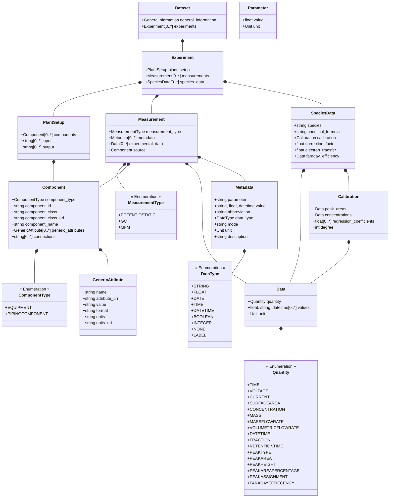

```mermaid
classDiagram
    Dataset *-- Experiment
    Experiment *-- PlantSetup
    Experiment *-- Measurement
    Experiment *-- SpeciesData
    PlantSetup *-- Component
    Measurement *-- MeasurementType
    Measurement *-- Component
    Measurement *-- Data
    Measurement *-- Metadata
    SpeciesData *-- Data
    SpeciesData *-- Calibration
    Component *-- ComponentType
    Component *-- GenericAttibute
    Data *-- Quantity
    Metadata *-- DataType
    Calibration *-- Data
    
    class Dataset {
        +GeneralInformation general_information
        +Experiment[0..*] experiments
    }
    
    class Experiment {
        +PlantSetup plant_setup
        +Measurement[0..*] measurements
        +SpeciesData[0..*] species_data
    }
    
    class PlantSetup {
        +Component[0..*] components
        +string[0..*] input
        +string[0..*] output
    }
    
    class Measurement {
        +MeasurementType measurement_type
        +Metadata[0..*] metadata
        +Data[0..*] experimental_data
        +Component source
    }
    
    class SpeciesData {
        +string species
        +string chemical_formula
        +Calibration calibration
        +float correction_factor
        +float electron_transfer
        +Data faraday_efficiency
    }
    
    class Component {
        +ComponentType component_type
        +string component_id
        +string component_class
        +string component_class_uri
        +string component_name
        +GenericAttibute[0..*] generic_attributes
        +string[0..*] connections
    }
    
    class GenericAttibute {
        +string name
        +string attribute_uri
        +string value
        +string format
        +string units
        +string units_uri
    }
    
    class Parameter {
        +float value
        +Unit unit
    }
    
    class Data {
        +Quantity quantity
        +float, string, datetime[0..*] values
        +Unit unit
    }
    
    class Metadata {
        +string parameter
        +string, float, datetime value
        +string abbreviation
        +DataType data_type
        +string mode
        +Unit unit
        +string description
    }
    
    class Calibration {
        +Data peak_areas
        +Data concentrations
        +float[0..*] regression_coefficients
        +int degree
    }
    
    class ComponentType {
        << Enumeration >>
        +EQUIPMENT
        +PIPINGCOMPONENT
    }
    
    class DataType {
        << Enumeration >>
        +STRING
        +FLOAT
        +DATE
        +TIME
        +DATETIME
        +BOOLEAN
        +INTEGER
        +NONE
        +LABEL
    }
    
    class Quantity {
        << Enumeration >>
        +TIME
        +VOLTAGE
        +CURRENT
        +SURFACEAREA
        +CONCENTRATION
        +MASS
        +MASSFLOWRATE
        +VOLUMETRICFLOWRATE
        +DATETIME
        +FRACTION
        +RETENTIONTIME
        +PEAKTYPE
        +PEAKAREA
        +PEAKHEIGHT
        +PEAKAREAPERCENTAGE
        +PEAKASSIGNMENT
        +FARADAYEFFIECENCY
    }
    
    class MeasurementType {
        << Enumeration >>
        +POTENTIOSTATIC
        +GC
        +MFM
    }
    
```