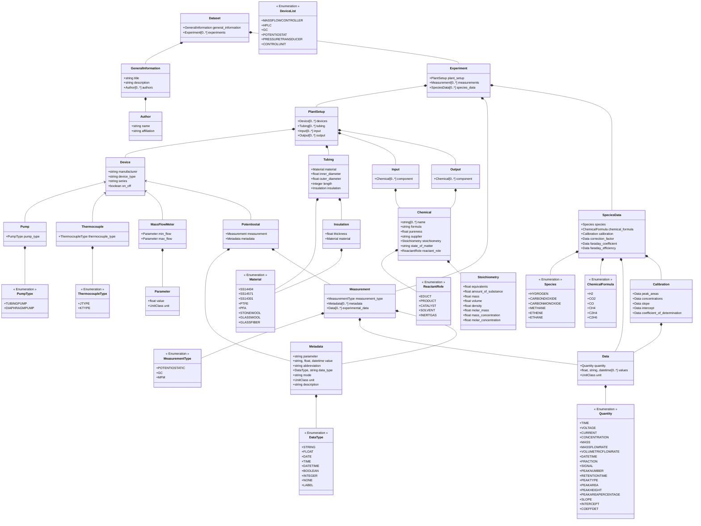

```mermaid
classDiagram
    Device <-- Pump
    Device <-- Thermocouple
    Device <-- MassFlowMeter
    Device <-- Potentiostat
    Dataset *-- GeneralInformation
    Dataset *-- Experiment
    GeneralInformation *-- Author
    Experiment *-- PlantSetup
    Experiment *-- Measurement
    Experiment *-- SpeciesData
    PlantSetup *-- Device
    PlantSetup *-- Tubing
    PlantSetup *-- Input
    PlantSetup *-- Output
    Pump *-- PumpType
    Thermocouple *-- ThermocoupleType
    MassFlowMeter *-- Parameter
    Potentiostat *-- Metadata
    Potentiostat *-- Measurement
    Tubing *-- Material
    Tubing *-- Insulation
    Insulation *-- Material
    Input *-- Chemical
    Output *-- Chemical
    Chemical *-- ReactantRole
    Chemical *-- Stoichiometry
    Data *-- Quantity
    Metadata *-- DataType
    Measurement *-- MeasurementType
    Measurement *-- Data
    Measurement *-- Metadata
    SpeciesData *-- Species
    SpeciesData *-- ChemicalFormula
    SpeciesData *-- Data
    SpeciesData *-- Calibration
    Calibration *-- Data
    
    class Dataset {
        +GeneralInformation general_information
        +Experiment[0..*] experiments
    }
    
    class GeneralInformation {
        +string title
        +string description
        +Author[0..*] authors
    }
    
    class Author {
        +string name
        +string affiliation
    }
    
    class Experiment {
        +PlantSetup plant_setup
        +Measurement[0..*] measurements
        +SpeciesData[0..*] species_data
    }
    
    class PlantSetup {
        +Device[0..*] devices
        +Tubing[0..*] tubing
        +Input[0..*] input
        +Output[0..*] output
    }
    
    class Device {
        +string manufacturer
        +string device_type
        +string series
        +boolean on_off
    }
    
    class Pump {
        +PumpType pump_type
    }
    
    class Thermocouple {
        +ThermocoupleType thermocouple_type
    }
    
    class MassFlowMeter {
        +Parameter min_flow
        +Parameter max_flow
    }
    
    class Parameter {
        +float value
        +UnitClass unit
    }
    
    class Potentiostat {
        +Measurement measurement
        +Metadata metadata
    }
    
    class Tubing {
        +Material material
        +float inner_diameter
        +float outer_diameter
        +integer length
        +Insulation insulation
    }
    
    class Insulation {
        +float thickness
        +Material material
    }
    
    class Input {
        +Chemical[0..*] component
    }
    
    class Output {
        +Chemical[0..*] component
    }
    
    class Chemical {
        +string[0..*] name
        +string formula
        +float pureness
        +string supplier
        +Stoichiometry stoichiometry
        +string state_of_matter
        +ReactantRole reactant_role
    }
    
    class Stoichiometry {
        +float equivalents
        +float amount_of_substance
        +float mass
        +float volume
        +float density
        +float molar_mass
        +float mass_concentration
        +float molar_concentration
    }
    
    class Data {
        +Quantity quantity
        +float, string, datetime[0..*] values
        +UnitClass unit
    }
    
    class Metadata {
        +string parameter
        +string, float, datetime value
        +string abbreviation
        +DataType, string data_type
        +string mode
        +UnitClass unit
        +string description
    }
    
    class Measurement {
        +MeasurementType measurement_type
        +Metadata[0..*] metadata
        +Data[0..*] experimental_data
    }
    
    class SpeciesData {
        +Species species
        +ChemicalFormula chemical_formula
        +Calibration calibration
        +Data correction_factor
        +Data faraday_coefficient
        +Data faraday_efficiency
    }
    
    class Calibration {
        +Data peak_areas
        +Data concentrations
        +Data slope
        +Data intercept
        +Data coefficient_of_determination
    }
    
    class DataType {
        << Enumeration >>
        +STRING
        +FLOAT
        +DATE
        +TIME
        +DATETIME
        +BOOLEAN
        +INTEGER
        +NONE
        +LABEL
    }
    
    class ThermocoupleType {
        << Enumeration >>
        +JTYPE
        +KTYPE
    }
    
    class Material {
        << Enumeration >>
        +SS14404
        +SS14571
        +SS14301
        +PTFE
        +PFA
        +STONEWOOL
        +GLASSWOOL
        +GLASSFIBER
    }
    
    class PumpType {
        << Enumeration >>
        +TUBINGPUMP
        +DIAPHRAGMPUMP
    }
    
    class ReactantRole {
        << Enumeration >>
        +EDUCT
        +PRODUCT
        +CATALYST
        +SOLVENT
        +INERTGAS
    }
    
    class DeviceList {
        << Enumeration >>
        +MASSFLOWCONTROLLER
        +HPLC
        +GC
        +POTENTIOSTAT
        +PRESSURETRANSDUCER
        +CONTROLUNIT
    }
    
    class Quantity {
        << Enumeration >>
        +TIME
        +VOLTAGE
        +CURRENT
        +CONCENTRATION
        +MASS
        +MASSFLOWRATE
        +VOLUMETRICFLOWRATE
        +DATETIME
        +FRACTION
        +SIGNAL
        +PEAKNUMBER
        +RETENTIONTIME
        +PEAKTYPE
        +PEAKAREA
        +PEAKHEIGHT
        +PEAKAREAPERCENTAGE
        +SLOPE
        +INTERCEPT
        +COEFFDET
    }
    
    class MeasurementType {
        << Enumeration >>
        +POTENTIOSTATIC
        +GC
        +MFM
    }
    
    class Species {
        << Enumeration >>
        +HYDROGEN
        +CARBONDIOXIDE
        +CARBONMONOXIDE
        +METHANE
        +ETHENE
        +ETHANE
    }
    
    class ChemicalFormula {
        << Enumeration >>
        +H2
        +CO2
        +CO
        +CH4
        +C2H4
        +C2H6
    }
    
```